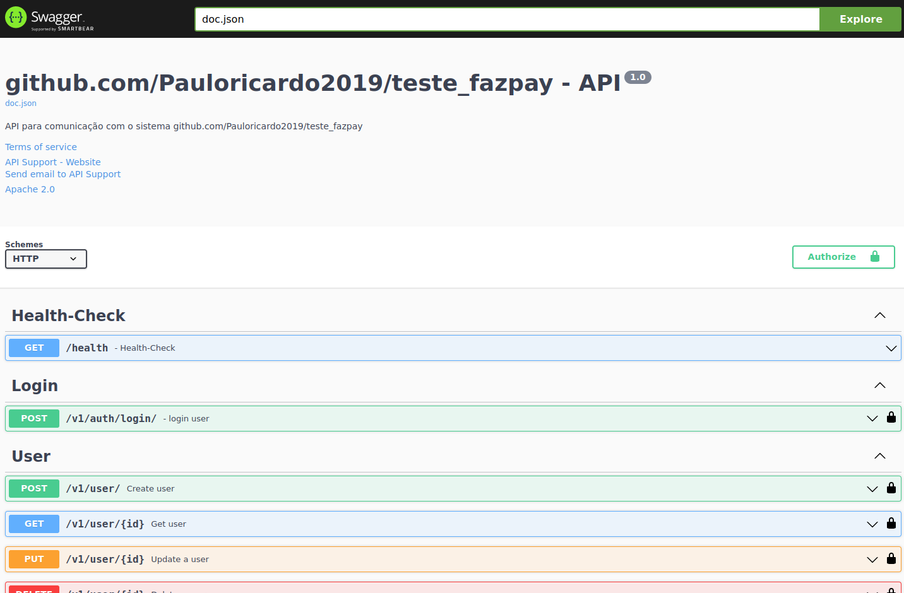

# FAZPAY-API



> Api para gerenciamento de usuários com a feature de login, cadastre-se faça o login e teste as funcionalidades da api.

## 💻 Pré-requisitos

Antes de começar, verifique se você atendeu aos seguintes requisitos:

- Você instalou o `Docker`

## ☕ Usando FAZPAY-API

Para usar fazpay-api, siga estas etapas:

```
<Abra seu terminal dentro do projeto "fazpay">
<Rode o comando: "docker-compose up -d">
<Agora é só esperar a criação e a execução da imgem docker>
<Para testar abra seu navegador e navegue para o link: "http:localhost:9090/swagger/index.html">
<Agora é só criar seu usuário e usar a api>
```

## ☕ Dicas para uso

Dicas para fazer os testes, siga estas etapas:

```
<Quando acessar o swagger, mude o "Schemes" para http>
<Crie um usuário e faça o login, a request do login irá retornar um json com o valor do token>
<Suba a pagina e clique em "Authorize", dentro do campo "value" digite "Bearer 'token_value'", coloque o valor do token>
<Pronto, agora você está autenticado no sistema.>
```

## 📐 Arquitetura

```
<Arquitetura: Ports and Adapters (Arquitetura Hexagonal)>
<Design-pattern: Facade>
```

## ℹ️ Informações sobre o projeto

```
<Bibliotecas: [gorm.io/gorm; github.com/uber-go/fx; github.com/uber-go/zap; github.com/gin-gonic/gin; github.com/swaggo/gin-swagger]>
<gorm.io/gorm: ORM para persistir dados no banco de dados>
<github.com/uber-go/fx: Biblioteca para abstrair injeção de dependencias em camadas>
<github.com/uber-go/zap: Biblioteca para apresentar os logs da aplicação>
<github.com/gin-gonic/gin: Framework web>
<github.com/swaggo/gin-swagger: Biblioteca para criar e gerar a documentação dos endpoints>
```

## 🤝 Colaboradores

Agradecemos às seguintes pessoas que contribuíram para este projeto:

<table>
  <tr>
    <td align="center">
      <a href="https://github.com/Pauloricardo2019" title="Visitar o perfil">
        <br>
        <sub>
          <b>Paulo Ricardo</b>
        </sub>
      </a>
    </td>
  </tr>
</table>

Esse projeto está sob licença. Veja o arquivo [LICENÇA](LICENSE.md) para mais detalhes.
